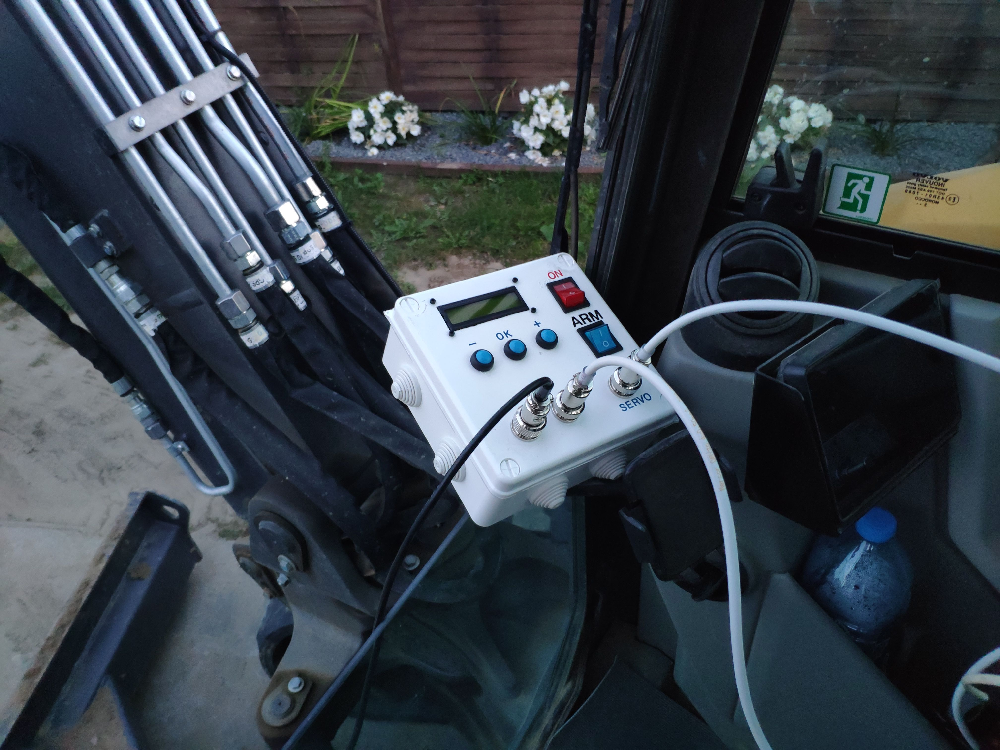
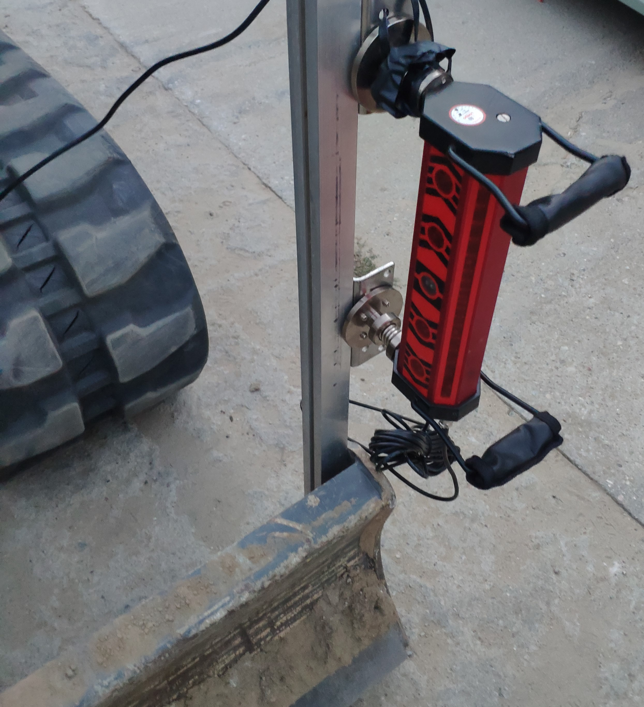
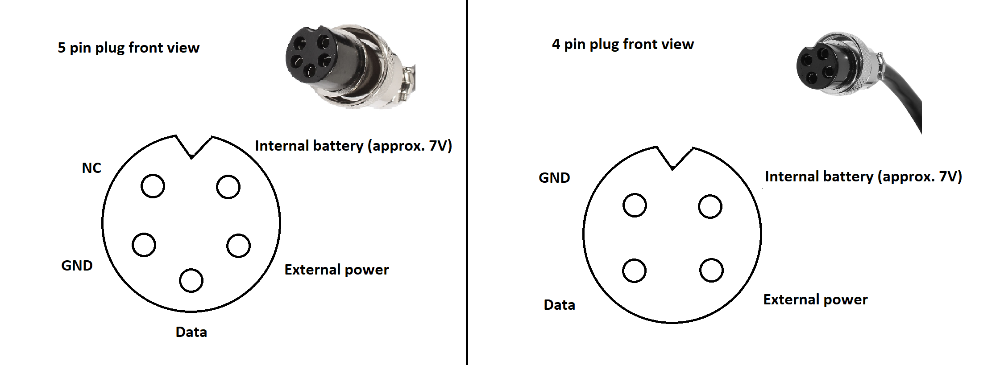
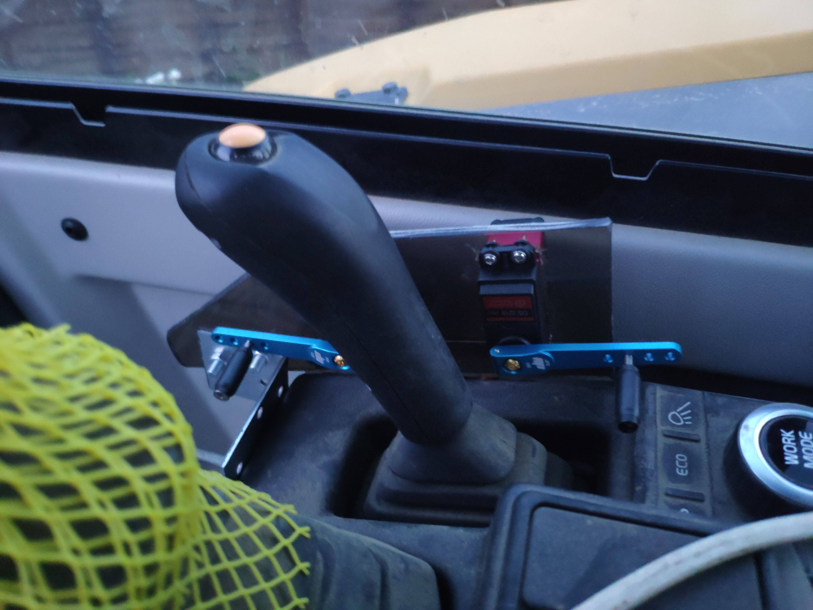
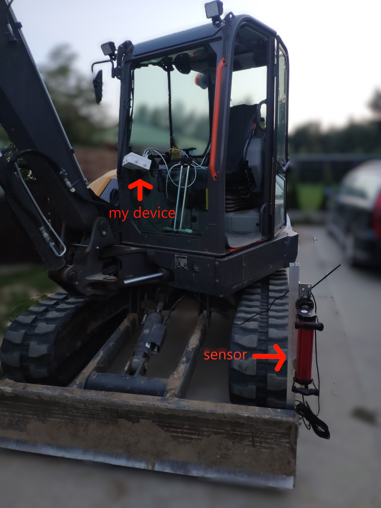
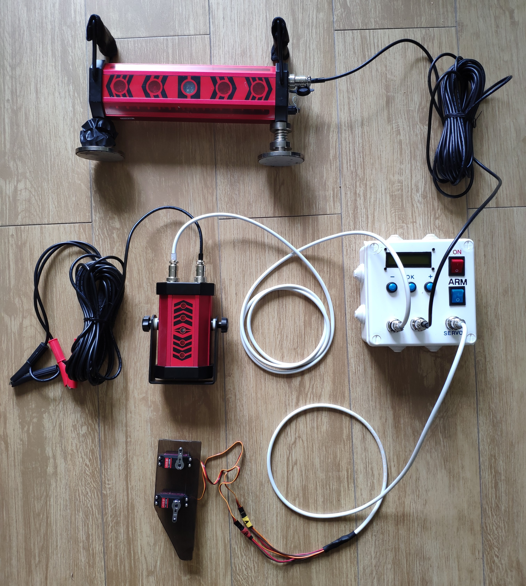

# Excavator Leveling

## About
Device designed to automate the leveling of the excavator. The device receives signals from the sensor mounted on the excavator blade and sends signals to the servo motors that push the control levers of the excavator.   

## Controller
The controller is based on the Atmega328P microcontroller.
The device has a 16x2 LCD display that allows the user to see the current offset from the middle position and the current state of the device. With the use of the buttons, the user can change the settings of the device without the need to connect it to the computer.
The device has a safety button that allows the user to switch between the manual "Disarmed" and automatic "Armed" mode.


## Sensor
The laser level sensor ([MC-1D](https://elmatsklep.pl/zestaw-czujnikow-do-koparki-mc-1d-nivel-system/)) is mounted on the excavator blade. The sensor measures the offset from the middle position.



No documentation was provided with the sensor, so the communication protocol had to be reverse-engineered.
The sensor is connected to the device via a cable with a 5-pin GX20 plug, of which only 4 pins are being used. The communication protocol appers to be a simple serial communication (9600 baud, 8 data bits, 1 stop bit, no parity).
The sensors transmits single byte of data every 20ms. The sensor has 5 LEDs that indicate the offset from the middle position. Each bit of the byte corresponds to one of the LEDs.
Three of the highest always form number 0b010, which allows to determine if correct data was received.   
Format of the data:
```
| Bit 7 | Bit 6 | Bit 5 | Bit 4 | Bit 3 | Bit 2 | Bit 1 | Bit 0 |
|---0---|---1---|---0---|--ld4--|--ld3--|--ld2--|--ld1--|--ld0--|
```
ldx - LED with index 'x'  
ld2 is in the center

Pinout:


## Servo motors
The controller is connected to the pair of servo motors that push the control levers of the excavator.


## Extra photos

Full view of the setup:   

